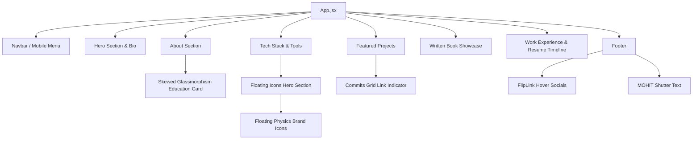

# Mohit Mudgil | Full-Stack and AI Engineer Portfolio

A premium, highly interactive dark-themed developer portfolio showcasing engineering capabilities, full-stack projects, written publications, and hackathon achievements. 

Built with React, Vite, and Tailwind CSS, this portfolio features physics-based floating brand bubbles, canvas animations, character-shutter roll transitions, and customized Github contribution charts.

---

## Technical Specifications

| Category | Technologies |
| :--- | :--- |
| **Frontend Core** | React.js (V5+ Hooks), Vite, HTML5, Vanilla CSS |
| **Styling & Theme** | Tailwind CSS v4, Modern Glassmorphism System |
| **Animations** | Framer Motion (Scroll, Spring Physics, Velocity, and Stagger transitions), CSS keyframe glow paths |
| **Iconography** | Lucide React, Custom brand SVGs (Hugging Face, Claude, Cursor, Meta, GSAP, Antigravity, Express) |
| **Deployment & Build** | Vite production compiler, Rolldown module optimizer |

---

## AI-Driven Engineering Stack

This portfolio was developed in collaboration with agentic coding environments and models:

*   **AI Agent Coder**: Developed with Antigravity, the Google DeepMind agentic coding system.
*   **Large Language Models**: Powered by Claude 3.5 Sonnet (4.6 config) for high-level UI refactoring and Gemini 3.5 Flash for swift iteration and code structure updates.
*   **Component Origins**: Customized components adapted from the 21st.dev React component marketplace, including staggered text animations and contribution graphs.

---

## Portfolio Architecture

Below is the layout of the modular components rendering the portfolio landing page:



---

## Features & Component Customizations

### 1. Skewed Glassmorphism Card (About Section)
An ultra-premium, interactive glass education card featuring a 6-degree skew transform and a double-blended linear gradient backing (#3b82f6 to #8b5cf6). It hosts floating animated backdrop blurs (animate-blob) that translate and cycle on hover.

### 2. Commits Grid Link Indicator (Projects Section)
An inline GitHub contribution calendar widget (16x3 grid) built directly inside each GitHub action link. The grid randomly pulses blank cells with subtle commit activity (animate-flash) and glows highlight letters spelling "GIT" on hover.

### 3. FlipLink Animations (Footer Section)
Text-based links in the footer that split names into letters and stagger their vertical translation delays (transitionDelay: i * 25ms) when the mouse hovers over the block.

---

## Getting Started

### Prerequisites
Make sure you have Node.js (v18+) installed.

### Installation
1. Clone the repository:
   ```bash
   git clone https://github.com/mohit4901/portfolio.git
   cd portfolio
   ```

2. Install dependencies:
   ```bash
   npm install
   ```

3. Launch local development server:
   ```bash
   npm run dev
   ```

4. Build production bundle:
   ```bash
   npm run build
   ```
